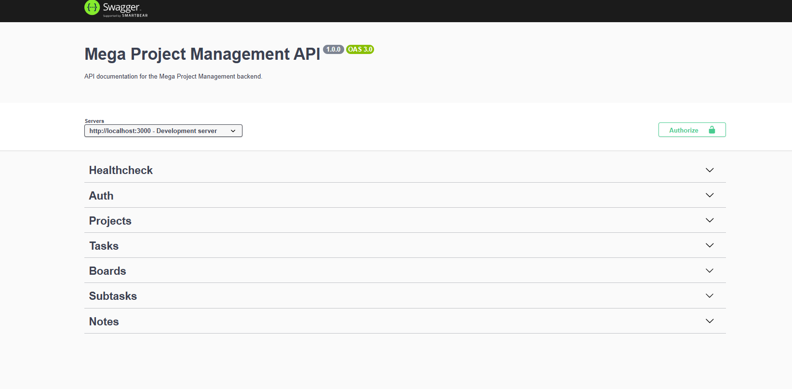
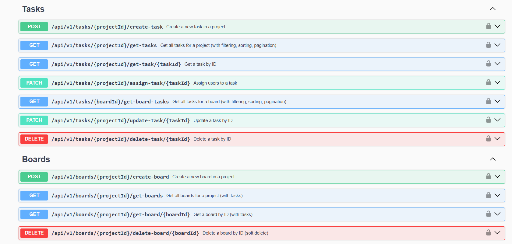
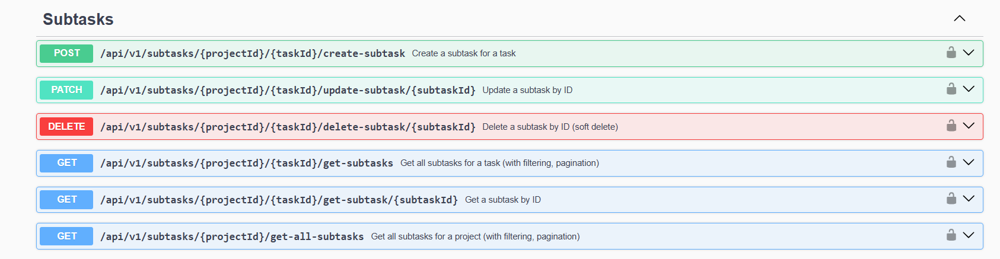
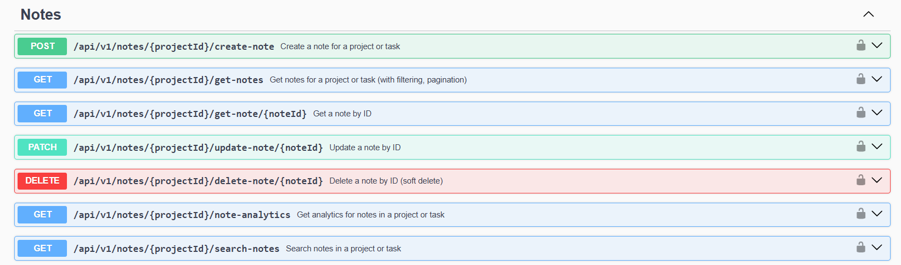

# Mega Project Management API

<p align="center">
  
  
  
  
  
  
  
  
  
  
</p>

<p align="center">
  <b>⭐ If you like this project, please consider starring it! ⭐</b><br>
  <i>"Don't be shy, hit that star button like it's a production bug! 🐞✨"</i>
</p>

A robust, secure, and scalable backend API for project, task, and team management. Built with Node.js, Express, and MongoDB. Features include authentication, RBAC, project/task/subtask/boards/notes management, notifications (scaffolded), and OpenAPI documentation.

---

## 🚀 Key Benefits

- **Enterprise-Ready Security:** JWT authentication, RBAC, rate limiting, CORS, and secure HTTP headers.
- **Modular & Scalable:** Clean separation of concerns, modular routes/controllers, and DRY OpenAPI docs.
- **Team Collaboration:** Projects, tasks, subtasks, boards, and notes for real-world team workflows.
- **Notifications System:** Scaffolded for in-app and email notifications (easy to enable/extend).
- **Modern API Standards:** Fully documented with OpenAPI 3.0, CI-validated, and ready for frontend or third-party integration.
- **Developer Experience:** Centralized error handling, logging, and easy local setup.

---

## Table of Contents

- [Features](#features)
- [Tech Stack](#tech-stack)
- [Getting Started](#getting-started)
- [API Documentation](#api-documentation)
- [Project Structure](#project-structure)
- [Scripts](#scripts)
- [Testing & Linting](#testing--linting)
- [Contributing](#contributing)
- [License](#license)
- [Acknowledgments](#acknowledgments)
- [Contact](#contact)

---

## Features

- **User Authentication:** Secure login, registration, and session management using JWT (access/refresh tokens) and HTTP-only cookies. Supports email verification and password reset flows.
- **Role-Based Access Control (RBAC):** Fine-grained permissions for project admins, members, and guests. Protects sensitive endpoints and enforces business rules at the API level.
- **Project Management:** Create, update, and delete projects. Each project can have multiple members with different roles and permissions.
- **Task Management:** Create, assign, update, and delete tasks within projects. Tasks support priorities, due dates, attachments, and assignment to multiple users.
- **Subtask Management:** Break down tasks into subtasks for granular tracking. Subtasks inherit permissions from their parent task/project.
- **Board (Kanban) Support:** Organize tasks visually using boards (e.g., To Do, In Progress, Done). Boards are linked to projects and support drag-and-drop workflows in the frontend.
- **Notes & Comments:** Add notes to projects and tasks for collaboration, documentation, or discussion. Notes support visibility (public/private) and are RBAC-protected.
- **Notifications System (Scaffolded):** Infrastructure for in-app and email notifications (e.g., task assignment, project invite). Easily extendable for future real-time or email alerts.
- **RESTful API with OpenAPI (Swagger) Docs:** All endpoints are documented with OpenAPI 3.0. Swagger UI is available in non-production for easy testing and integration.
- **Security Best Practices:** Includes rate limiting, CORS, secure HTTP headers (Helmet), input validation, and centralized error handling to protect against common web vulnerabilities.
- **Centralized Error Handling & Logging:** Consistent error responses and detailed logging using Winston for easier debugging and monitoring.
- **CI/CD Ready:** Automated Swagger/OpenAPI linting and validation in CI to ensure API documentation stays up-to-date and accurate.
- **Scalable & Modular Codebase:** Clean separation of concerns with modular routes, controllers, models, validators, and utilities. Easy to extend and maintain as your team or requirements grow.
- **Docker-Ready for MongoDB:** Supports running MongoDB in a Docker container for local development and testing.

## Tech Stack

- **Backend:** Node.js (18.x), Express.js (4.x) — Core server and routing framework
- **Database:** MongoDB (with Mongoose ODM) — Flexible NoSQL storage and schema modeling
- **Authentication & Security:**
  - JWT (jsonwebtoken) — Access/refresh token authentication
  - HTTP-only cookies — Secure session management
  - bcryptjs — Password hashing
  - express-rate-limit — API rate limiting
  - helmet — Secure HTTP headers
  - cors — Cross-origin resource sharing
  - express-validator — Input validation and sanitization
- **Email & Notifications:**
  - Nodemailer — Transactional email delivery
  - Mailgen — Beautiful email templates
  - (Scaffolded) Notification system for in-app/email alerts
- **File Uploads & Media:**
  - multer — File upload middleware
  - cloudinary & multer-storage-cloudinary — Cloud image storage
- **API Documentation:**
  - Swagger (OpenAPI 3.0 via swagger-jsdoc & swagger-ui-express) — Interactive API docs
- **Utilities & Tooling:**
  - dotenv — Environment variable management
  - winston — Logging
  - morgan — HTTP request logging
  - prettier — Code formatting
  - nodemon — Hot-reloading for development
- **Testing & Linting:**
  - (Add your test framework here)
  - Custom scripts for Swagger/OpenAPI linting and CI validation
- **CI/CD & Automation:**
  - GitHub Actions — Automated linting, OpenAPI validation, and workflow automation
- **DevOps & Environment:**
  - Docker (for MongoDB in local/dev)
  - .env files for configuration
- **Project Structure:** Modular organization (controllers, routes, models, middlewares, utils, validators, swagger docs, scripts)

Each technology is chosen for reliability, scalability, and best practices in modern Node.js backend development.

> **Note:** All dependencies are listed in [package.json](package.json). The stack is modular and easy to extend for future features (e.g., notifications, real-time updates, advanced testing).

## Getting Started

### Prerequisites

- **Node.js** >= 18.x
- **MongoDB** (local instance or MongoDB Atlas)
- (Optional) **Docker** for running MongoDB locally

### Installation

```bash
# Clone the repository
git clone https://github.com/sagar-1m/COHORT-TaskManager.git

cd COHORT-TaskManager

# Install dependencies
npm install
```

### Environment Setup

1. Copy the example environment file:

   ```powershell
   cp .env.example .env
   ```

2. Open `.env` and fill in all required variables:

   - Use placeholder/test credentials for local development (see comments in `.env.example`).
   - For production, set strong secrets and real service credentials.
   - Never commit your real `.env` file or secrets to version control.

3. For email features, use [Mailtrap](https://mailtrap.io/) credentials for safe testing.
4. For file uploads, set up a [Cloudinary](https://cloudinary.com/) account and use your API keys.

### Running the App

```powershell
# Start the development server
npm run dev

# Or, start with nodemon for hot-reloading
npx nodemon src/index.js
```

### Running MongoDB with Docker (Optional)

If you don't have MongoDB installed locally, you can run it in a Docker container:

```powershell
docker run --name mongodb -p 27017:27017 -d mongo:latest
```

- By default, the app will connect to `mongodb://localhost:27017/sampleTaskManager` as shown in `.env.example`.
- You can change the database name in your `.env` file if needed.

### Troubleshooting

- If you see connection errors, check your MongoDB service and `.env` values.
- For email features, use Mailtrap credentials for safe testing.
- For file uploads, set up Cloudinary credentials or use test values.

## API Documentation

The API is fully documented using **OpenAPI 3.0 (Swagger)**, making it easy to explore, test, and integrate with any frontend or third-party service.

- **Interactive Swagger UI:**

  - Available at [http://localhost:3000/api-docs](http://localhost:3000/api-docs) (non-production only)
  - Browse endpoints, view request/response schemas, and try out API calls directly from your browser.
  - Example screenshots:
    - 
    - 
    - 
    - 
    - 
    - 

- **Export OpenAPI Spec:**

  - Run `npm run export:swagger` (or `node scripts/export-swagger.js`) to generate `swagger.json`.
  - Import `swagger.json` into [Swagger Editor](https://editor.swagger.io/) or [Postman](https://www.postman.com/) for further exploration, testing, or client SDK generation.

- **CI/CD Validation:**
  - All OpenAPI docs are linted and validated automatically in CI to ensure accuracy and up-to-date documentation.

## Project Structure

The project is organized for clarity, modularity, and scalability. Here’s an overview of the main folders and files:

```
├── .github/              # GitHub Actions workflows and community files
├── docs/                 # API documentation screenshots and assets
├── public/               # Static assets (e.g., images)
├── scripts/              # Automation and utility scripts (swagger-lint.js, export-swagger.js, etc.)
├── src/                  # Main backend source code
│   ├── controllers/      # Route handlers (business logic)
│   ├── db/               # Database connection setup
│   ├── middlewares/      # Express middlewares (auth, validation, rate limiting, etc.)
│   ├── models/           # Mongoose models (MongoDB schemas)
│   ├── routes/           # Express route definitions
│   ├── swagger/          # Modular OpenAPI (Swagger) docs
│   ├── utils/            # Utilities (logger, mail, error handling, etc.)
│   ├── validators/       # Request validation logic
│   ├── app.js            # Express app setup
│   └── index.js          # App entry point
├── .env.example          # Example environment variables
├── .gitignore            # Git ignore rules
├── .prettierrc           # Prettier code formatting config
├── .prettierignore       # Prettier ignore rules
├── CODE_OF_CONDUCT.md    # Community guidelines
├── LICENSE               # Project license
├── package.json          # Project metadata and dependencies
├── package-lock.json     # Dependency lockfile
├── README.md             # Project documentation
├── swagger.json          # Exported OpenAPI spec
```

> **Notes:**
>
> - Each folder in `src/` is modular, making it easy to extend or maintain.
> - The `docs/` folder contains images/screenshots for the README and API documentation.
